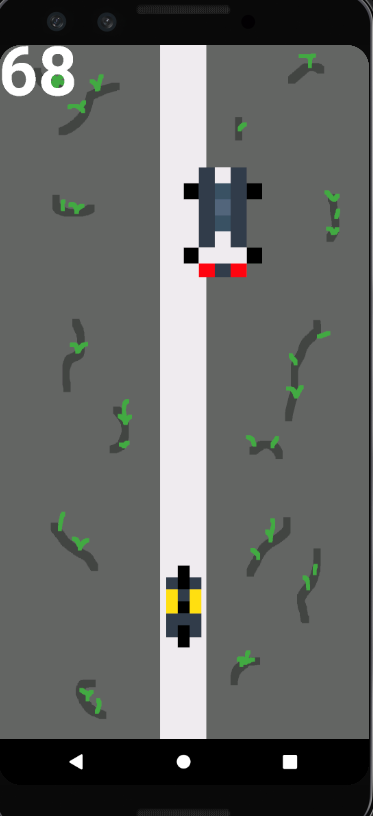
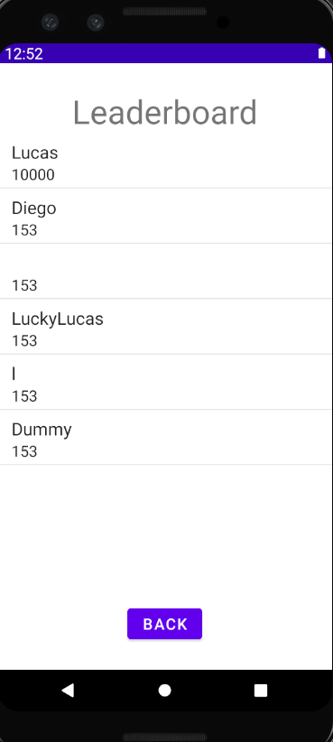

# OSTandfurious
In this game, you have to steer clear of other cars and get as far as possible. Can you get the record?

Ostandfurious ist ein Mobile Game für das Modul Mobile and GUI Engineering (MGE).
Versuche den entgegenkommenden Fahrzeugen auszuweichen und fahre so weit wie möglich um den Rekord zu schlagen!

## Funktionen

Nachdem man die Applikation startet, landet man auf der Startseite des Spiels. Von hier aus kannst du entweder einen Spielernamen eingeben und ein Spiel starten, über den Button Leaderboard die Rangliste anschauen oder über den Credits Button anschauen wer das Spiel kreiiert hat. Darüber hinaus kannst du mit dem Button unten rechts die Sprache von Englisch auf Deutsch umstellen.

Versuche mit deinem Smartphone den Autos auszuweichen und komme soweit wie möglich!

Wenn du mit einem Auto in Kontakt kommst, ist das Spiel leider vorbei.

Auf dem Leaderboard siehst du, wie gut (oder schlecht) du warst mit deinem Versuch.

## Requirements

- Funktionalität pro Screen (Hauptbildschirm, Game, Rangliste, Credits) 3 Punkte

- Persistenz / Offlinefähigkeit 2 Punkte

- Verwendung von Jetpack-Komponenten (Room, ConstraintLayout, RecyclerView) 3 Punkte

- Verwendung von Notifications 2 Punkte

- Verwendung von Aktoren oder Sensoren 1 Punkte

- Ressourcen: Lokalisierung 2 Punkte

  Total: 13 Punkte
